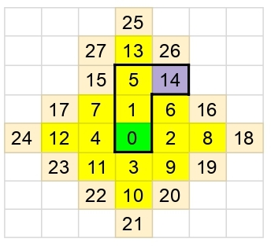
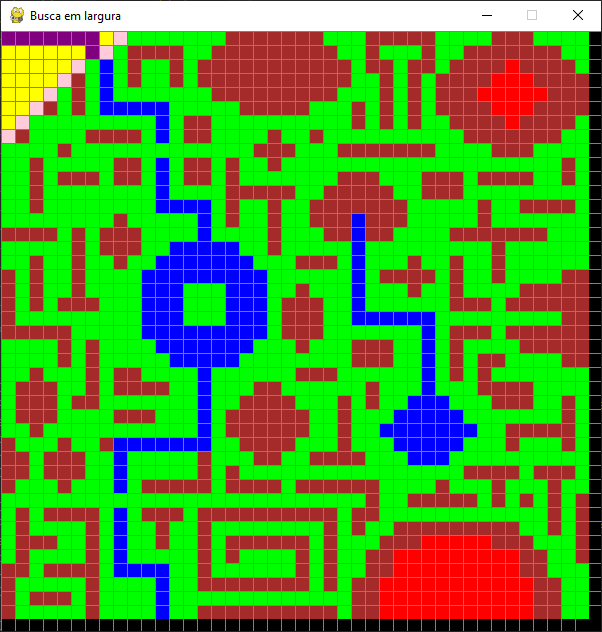
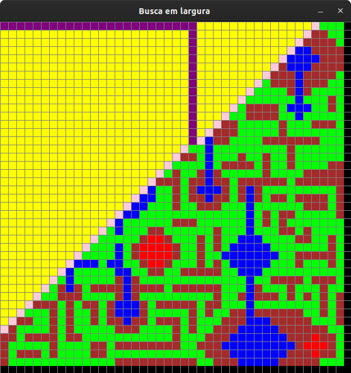
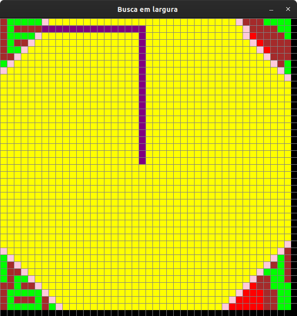

# Pathfinding BFS AI


## Descrição

Este projeto consiste em um sistema de navegação automática de um robô utilizando o algoritmo de busca em largura.

A região de busca é determinada por um arquivo de entrada (.csv), contendo as posições de partida, de destino e um mapa 42x42.

A movimentação da busca é realizada somente na vertical e horizontal, seguindo o padrão norte, leste, sul e oeste (N->L->S->O), assim como na figura abaixo, em que a cor verde representa o ponto de partida, a cor lilás representa o destino, as células amarelas representam as posições por onde o algoritmo percorreu, as em bege representam as células presentes na fila, sendo elas as próximas a serem executadas.



## Como executar
* Execute o programa a partir do arquivo `front.py`.
* Selecione um arquivo CSV que contenha a seguinte sintaxe:
```
posição inicial x, posição inicial y
posição final x, posição final y
matriz
```
* Após selecionar e o programa realizar a verificação do mesmo, será aberta uma janela demonstrando o mapa.
* Pressione `espaço` para iniciar o algoritmo de busca em largura.
* Ao encontrar o caminho, o algoritmo mostrá-lo-á do destino ao início e exibirá seu respectivo custo.

## Mapas

Tipo | Cor | Valor (CSV) | Custo
:---: | :---: | :---: | :---:
Sólido e plano | Verde | 1 | 1
Montanhoso | Marrom | 2 | 5
Pântano | Azul | 3 | 10
Fogo | Vermelho | 4 | 15
Posição inicial | Laranja | - | -
Posição de destino | Turquesa | - | -
Posição na fila para visitação | Lilás | - | -
Posição já visitada | Amarelo | - | -
Caminho encontrado | Roxo | - | -

### Mapa 1


### Mapa 2


### Mapa 3*


### Mapa 4


* Mapas retangulares não possuem uma boa visualização na interface

## Resultados

Para calcular o custo total, o programa realiza a soma de custos de toda a trajetória, ou seja, o custo do início, os custos pertencentes à trajetória do caminho encontrado pelo algoritmo e também o custo da posição final.

## Exemplo de execução


Com custo total: 12.



Com custo total: 117.



Com custo total: 115